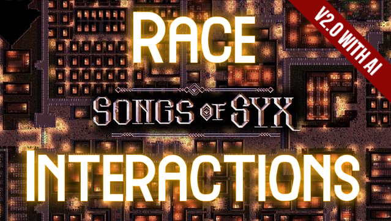
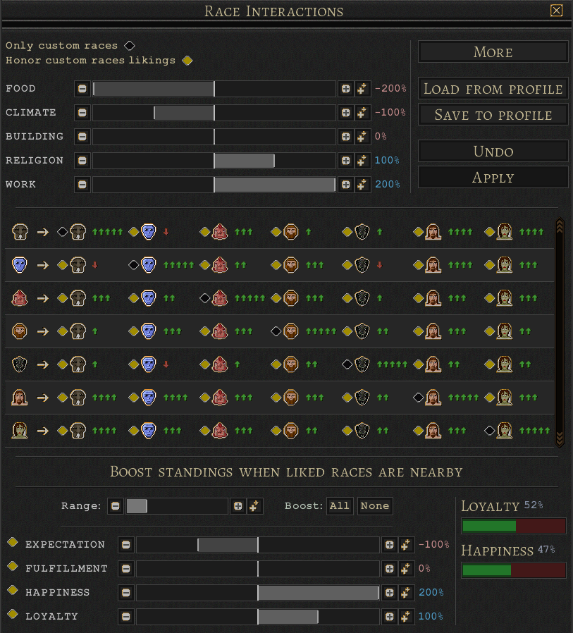
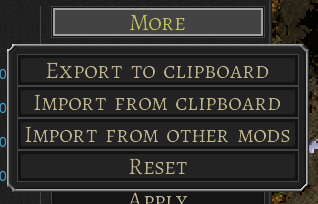
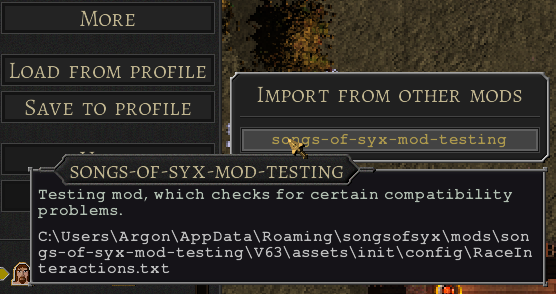

# Songs of Syx Mod Race Interactions

Will adjust the likings of each other race according to their similarities in preferences. 
For example when two races like to live only in WOOD building structures and both hate every other structure, their "liking" to each other will increase.
This will make the assignment of who likes who more dynamic.

* **Steam** https://steamcommunity.com/sharedfiles/filedetails/?id=2937853965
* **Mod.io** https://mod.io/g/songsofsyx/m/race-interactions
* **NexusMods** https://www.nexusmods.com/songsofsyx/mods/11



## v2.0.0

With version **v2.0.0** citizens became a new AI. They will now look for other races nearby. 
The standings "Happiness", "Loyalty", "Expectations" and "Fulfillment" will get boosted for liked races.


## But why?!

This was suggested in the [Discord](https://discord.gg/USqtpm89) of Songs of Syx by the user **Twiggy#3123** and solves the following problem.
When a player has multiple race mods installed, there are usually no interactions between these. This mod will dynamically add likings between them.

## Config

You can find a config button in the bottom menu of the game:


There you can set the different weights and see the results:



### Change likings between races

* **Only custom races:** whether the configuration should affect any vanilla game races.
* **Honor custom races likings:** whether, the mod shall manipulate already set likings to other races in custom modded races.
* **Sliders:** (FOOD, CLIMATE, BUILDING, RELIGION) will affect how much the similarity in a certain category should influence the likings between races.

### Boost standings for liked races nearby

* **Race toggles:** in front of each race icon is a toggle. There you can define whether a race should get boosted when near the other race.
* **Range:** affects the distance where citizens look for other races.
* **Boost:** toggle boost for all races on or off.
* **Sliders:** (EXPECTATION, FULFILLMENT, HAPPINESS, LOYALTY) adjusts boosting of different standings when races are nearby other liked races.

### Saving, reusing and sharing config

The current configuration is stored into the games save file.
It can also be saved into the games **profile folder** for reusing it in another save:

```
%USERPROFILE%\AppData\Roaming\songsofsyx\saves\profile
```

* **Load from profile:** load a saved configuration from the games profile folder
* **Save to profile:** save current configuration to the games profile folder

#### More Button



* **Export to clipboard:** will export the current configuration as base64 string into your clipboard. You can paste it from the clipboard with `CTRL + V`.
* **Import from clipboard:** will import a base64 encoded configuration from your clipboard. You can copy it into the clipboard with `CTRL + C`.
* **Reset:** will restore the vanilla likings of the races and set the configuration to default settings.
* **Import from other mods:** will open up a selection of configurations found in other active mods to import



### For race mod authors

The mod will scan for configuration provided by other active mods. 
So you can provide your own configuration bundled with your race mod.
You have to put it into the following directory of your mod to work:

```
assets/init/config/RaceInteractions.txt
```

# Getting started

[Maven](https://maven.apache.org/) is required to compile, package and install the mod.

**(1)** Do all at once: Install games jar file as dependency; compile mod source; prepare mod file structure; copy mod files to game mod directory
```
mvn -P install-local-game validate install
```

**(!)** Game installation and mod directory paths are configured in the `pom.xml` in the `<profiles>` and are default set to:

**Game Installation**
* **Windows:** C:\Program Files (x86)\Steam\steamapps\common\Songs of Syx
* **Linux:** ~/.steam/steam/SteamApps/common/Songs of Syx

**Mod Directory**
* **Windows:** ${user.home}/AppData/Roaming/songsofsyx/mods/
* **Linux:** ~/.local/share/songsofsyx/mods/


**(2)** Run the game and you should see a `Race Interactions` mod. Activate it and launch.

**(3)** Start a new game. In the new game settings activate the `Race Interactions` under **Scripts**.

# Build commands

**(i)** Installs only the games `SongsOfSyx.jar` and `info/SongsOfSyx-sources.jar` as a dependency, and validate whether it was successful.
```
mvn -P install-local-game validate
```

**(!)** This is required or the project won't find the games code.

**(i)** Building the mod only into `target/out`:
```
mvn package
```

The source code of the mod will be copied into e.g. `target/out/songs-of-syx-mod-example/V63/script/_src`.

**(i)** Build and copy the output into the games mods folder (excluding `_src`):
```
mvn install
```

**(!)** The games mod folder location varies on each OS. There are maven profiles "windows" and "linux". The "windows" profile is the default.
Maven should detect when you are building on a Linux OS and switch to the "linux" profile (not tested).
You can force a profile with e.g.

```
mvn install -P linux
```

**(i)** Deletes the `target` directory containing the packaged mod files and removes the mod from the games mod directory.
```
mvn clean
```

# Mod Info / Build Settings

In the `pom.xml` you will find `<properties>` where you can change information about the mod.
There you can also change the `<game.version.major>` property to your used game version. 
The `<game.version.minor>` property is only important when your mod really depends on stuff in this version and isn't compatible with lower versions.

Files (e.g. assets) for the mod are located in `src/main/java/resources/mod-files` and will be copied in the `package` phase.

# Debugging

You can enable **Debug Mode** and **Developer Mode** in the game launcher **settings**. 
You will get more detailed logs and in-game developer tools for testing.

## Intellij IDEA

There are two `.xml`files in the `.run/` folder:

* `Main.run.xml` launches the game directly
* `MainLaunchLauncher.run.xml` starts the game launcher

You may want to edit the `WORKING_DIRECTORY` option to your local game installation path.
It's default set to: `C:/Program Files (x86)/Steam/steamapps/common/Songs of Syx`.

And your package name may also differ in the `PATTERN` option.
It's default set to: `jake.example.*`

They should be automatically available [in the IDE](https://www.jetbrains.com/help/idea/run-debug-configuration.html). 
You can also edit them there :)

## Eclipse

* Add a new [Run Configuration](https://www.subjectcoach.com/tutorials/detail/contents/beginners-guide-to-eclipse-ide/chapter/working-with-run-configurations).
* Set the **main class** name to `init.MainLaunchLauncher`.
* In the tab **Arguments** set the **working directory** to your game installation folder e.g. `C:/Program Files (x86)/Steam/steamapps/common/Songs of Syx`.


